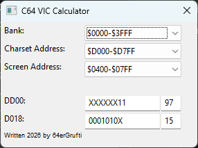

C64 VIC calculator
===
Der C64 VIC Calculator dient der Berechnung der Werte zur Festlegung von Bildschirm- und Zeichenspeicher. Beim Start
werden die Werte geladen, die ein C64 normalerweise nach der Einschaltmeldung hat.


Dabei gibt es 3 verschiedene Möglichkeiten, die Berechnung zu veranlassen:

1. Sie wählen im oberen Teil eine Bank und Speicherort für Bildschirm- und Zeuchenspeicher. Die Bitmaske und der hexadezimale Wert werden demensprechend berechnet.
2. Sie geben eine Bitmaske ein. Der passende Hexadezimalwert und im oberen Bereich die Speicherangaben werden berechnet.
3. Sie geben einen Hexadezimalwert ein. Die passende Bitmaske und im oberen Bereich die Speicherangaben werden berechnet.

## Bitmaske
Bei der Behandlung der Bitmaske gibt es eine Besonderheit. Wird ein X als Bitwert eingegeben, so wird an dieser Stelle
automatisch der Standardwert eingesetzt. Genauso verhält es sich bei Eingabe eines Hexadezimalwertes oder Wahl im oberen
Bereich. In diesem Fall werden automatisch Bitstellen, die nichts mit Bildschirm- und Zeichenspeicher zu tun haben,
durch X ersetzt.

## Besonderheit Bank 0 & 2
In den Bänken 0 (\$0000-\$03FF) und 2 (\$8000-\$BFFF) gibt es beim C64 die Besonderheit, dass teilweise trotzdem aufs
Original-ROM zugegriffen wird. Diese Besonderheit wird in der Anzeige im oberen Bereich berücksichtigt. Im Gegenzug
zeigt dies aber auch, dass in den Bänken 1 & 3 der ROM-Zeichensatz nicht verfügbar ist und somit für einen eigenen
Zeichensatz gesorgt werden muss.

# Installation
Da das Programm unter Python läuft, ist natürlich Python ab Version 3.10 notwendig. Ansonsten wird nur noch wxPython für die grafische
Oberfläche benötigt. Dieses lässt sich ganz einfach mit
```commandline
python -m pip install -r requirements.txt
```
installiert werden. Gestartet wird das Programm dann mit
```commandline
python c64_vic.py
```
# Binaries
Unter den Releases werden auch Binaries für Windows und Linux bereit gestellt.